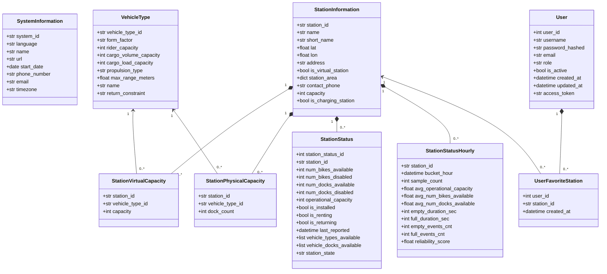

# Class diagrams

## Classes of data models

```mermaid
classDiagram
    direction TB

    %% ==========================================
    %% DOMAIN ENTITIES / MODELS
    %% ==========================================
    class SystemInformation {
        +str system_id
        +str language
        +str name
        +str url
        +date start_date
        +str phone_number
        +str email
        +str timezone
    }

    class VehicleType {
        +str vehicle_type_id
        +str form_factor
        +int rider_capacity
        +int cargo_volume_capacity
        +int cargo_load_capacity
        +str propulsion_type
        +float max_range_meters
        +str name
        +str return_constraint
    }

    class StationVirtualCapacity {
        +str station_id
        +str vehicle_type_id
        +int capacity
    }

    class StationPhysicalCapacity {
        +str station_id
        +str vehicle_type_id
        +int dock_count
    }

    class StationInformation {
        +str station_id
        +str name
        +str short_name
        +float lat
        +float lon
        +str address
        +bool is_virtual_station
        +dict station_area
        +str contact_phone
        +int capacity
        +bool is_charging_station
    }

    class StationStatus {
        +int station_status_id
        +str station_id
        +int num_bikes_available
        +int num_bikes_disabled
        +int num_docks_available
        +int num_docks_disabled
        +int operational_capacity
        +bool is_installed
        +bool is_renting
        +bool is_returning
        +datetime last_reported
        +list vehicle_types_available
        +list vehicle_docks_available
        +str station_state
    }

    class StationStatusHourly {
        +str station_id
        +datetime bucket_hour
        +int sample_count
        +float avg_operational_capacity
        +float avg_num_bikes_available
        +float avg_num_docks_available
        +int empty_duration_sec
        +int full_duration_sec
        +int empty_events_cnt
        +int full_events_cnt
        +float reliability_score
    }

    class User {
        +int user_id
        +str username
        +str password_hashed
        +str email
        +str role
        +bool is_active
        +datetime created_at
        +datetime updated_at
        +str access_token
    }

    class UserFavoriteStation {
        +int user_id
        +str station_id
        +datetime created_at
    }

    %% Entity Relations
    VehicleType "1" <-- "0..*" StationVirtualCapacity
    StationInformation "1" *-- "0..*" StationVirtualCapacity
    StationInformation "1" *-- "0..*" StationPhysicalCapacity
    VehicleType "1" <-- "0..*" StationPhysicalCapacity
    StationInformation "1" *-- "0..*" StationStatus
    StationInformation "1" *-- "0..*" StationStatusHourly
    StationInformation "1" <-- "0..*" UserFavoriteStation
    User "1" *-- "0..*" UserFavoriteStation
```

## Classes of program

```mermaid
classDiagram
    direction LR
    %% ==========================================
    %% CONTROLLERS
    %% ========================================== 
    class AuthAndUserController {
        -UserService user_service
        
        +signup(payload: dict) str
        +login(payload: dict) dict
        +logout() str

        +get_user_info() User
        +update_user_info(payload: dict) str
    }

    class AdminController {
        -UserService user_service

        +list_users(payload: dict) list~User~
        +update_user_status(user_id: int, is_active: bool) str
    }

    class FavoriteStationController {
        -FavoriteStationService favorite_service

        +add_favorite(station_id: str) str
        +list_favorites(payload: dict) list~StationInformation~
        +remove_favorite(station_id: str)
    }

    class StationController {
        -StationService station_service

        +get_station_info(station_id: str) StationInformation
        +list_stations(payload: dict) list~StationInformation~
        +get_station_current_status(station_id: str) dict

        +get_station_history(payload: dict) list~dict~
    }

    class RecommendationController {
        -RecommendationService recommendation_service

        +get_nearby_recommendations(payload: dict) list~dict~
    }

    %% ==========================================
    %% SERVICES
    %% ==========================================
    class UserService {
        -UserDAO user_dao

        +signup(dto: dict) bool
        +login(username: str, password_hashed: str) str
        +logout(user_id: int) bool

        +list_users(query_params: dict) list~User~
        +update_user(user_id: int, updates: dict) bool
    }

    class FavoriteStationService {
        -FavoriteStationDAO favorite_dao

        +add_favorite_station(user_id: int, station_id: str) bool
        +list_favorites(query_params: dict) list~StationInformation~
        +remove_favorite_station(user_id: int, station_id: str) bool
    }

    class StationService {
        -StationDAO station_dao
        -StationStatusDAO status_dao
        -StationStatusHourlyDAO hourly_dao
        
        +list_stations(query_params: dict) list~StationInformation~
        +get_station_current_status(station_id: str) dict
        +get_station_history(query_params: dict) list~dict~
    }

    class RecommendationService {
        -StationDAO station_dao
        -StationStatusDAO status_dao
        -StationStatusHourlyDAO hourly_dao

        +get_nearby_recommendations(query_params: dict) list~dict~
    }

    %% ==========================================
    %% DATA ACCESS OBJECTS
    %% ==========================================
    class UserDAO {
        +create_user(user: User) bool

        +get_by_id(user_id: int) User
        +get_by_username(username: str) User
        +get_by_access_token(token: str) User
        
        +list_users(query_params: dict) list~User~
        
        +update_user(user_id: int, updates: dict) bool
        +delete_user(user_id: int) bool
    }

    class FavoriteStationDAO {
        +add_favorite(user_id: int, station_id: str) bool
        +list_by_user(user_id: int) list~StationInformation~
        +count_favorites(station_ids: list~str~) dict~str, int~
        +remove_favorite(user_id: int, station_id: str) bool
    }

    class StationDAO {
        +upsert_station_info(station: StationInformation) bool

        +get_by_id(station_id: str) StationInformation
        +get_nearby(lat: float, lon: float, radius_meters: float) list~StationInformation~

        +list_stations(query_params: dict) list~StationInformation~
    }

    class StationStatusDAO {
        +bulk_insert_status(records: list~StationStatus~) int

        +get_latest_status(station_id: str) StationStatus
        +get_status_history(station_id: str, start_time: datetime, end_time: datetime) list~StationStatus~
    }

    class StationStatusHourlyDAO {
        +bulk_insert_hourly_stats(records: list~StationStatusHourly~) int
        +get_hourly_stats(station_id: str, start_time: datetime, end_time: datetime) list~StationStatusHourly~
        +aggregate_daily_stats(station_id: str, start_date: date, end_date: date) list~dict~
    }

    %% ==========================================
    %% JOBS
    %% ==========================================
    class JobScheduler {
        +add_job(func, trigger, seconds, args)
        +start()
    }

    class DataIngestionService {
        -HttpClient http_client
        
        +execute_strategy(strategy: FeedIngestionStrategy) int
    }

    class FeedIngestionStrategy~T~ {
        <<abstract>>
        #str feed_name
        #int interval_seconds
        #str url

        +parse_payload(headers: dict, raw_data: dict)* list~T~
        +persist(records: List~T~)* int
    }    

    class StationInformationStrategy {
        -StationDAO dao
        -str feed_name
        -int interval_seconds
        -str url
        
        +parse_payload(headers: dict, raw_data: dict) List~StationInformation~
        +persist(entities: List~StationInformation~) int
    }

    class StationStatusStrategy {
        -StationStatusDAO dao
        -str feed_name
        -int interval_seconds
        -str url
        
        +parse_payload(headers: dict, raw_data: dict) List~StationStatus~
        +persist(entities: List~StationStatus~) int
    }

    class StationStateClassifier {
        +classify_state(status: StationStatus) str
    }

    class StationCapacityCalculator {
        +calculate_capacity(station_status: StationStatus) int
    }

    class StationAggregationService {
        -StationStatusDAO station_status_dao
        -StationStatusHourlyDAO station_hourly_dao

        +aggregate_hourly_stats() int
    }

    class StationStateDurationCalculator {
        +calculate_durations(station_status: list~StationStatus~) list~dict~
    }

    class StationReliabilityCalculator {
        +calculate_reliability(station_status_hourly: StationStatusHourly) float
    }

    %% ==========================================
    %% DEPENDENCIES
    %% ========================================== 
    AuthAndUserController --> UserService
    AdminController --> UserService
    FavoriteStationController --> FavoriteStationService
    StationController --> StationService
    RecommendationController --> RecommendationService
    
    UserService --> UserDAO

    FavoriteStationService --> FavoriteStationDAO

    StationService --> StationDAO
    StationService --> StationStatusDAO
    StationService --> StationStatusHourlyDAO

    RecommendationService --> StationDAO
    RecommendationService --> StationStatusDAO
    RecommendationService --> StationStatusHourlyDAO

    JobScheduler ..> DataIngestionService : triggers
    JobScheduler ..> StationAggregationService : triggers
    DataIngestionService ..> FeedIngestionStrategy : executes
    FeedIngestionStrategy <|-- StationInformationStrategy
    FeedIngestionStrategy <|-- StationStatusStrategy

    StationInformationStrategy --> StationDAO
    StationStatusStrategy --> StationStatusDAO
    StationAggregationService --> StationStatusDAO
    StationAggregationService --> StationStatusHourlyDAO

    StationStatusStrategy ..> StationStateClassifier : uses
    StationStatusStrategy ..> StationCapacityCalculator : uses

    StationAggregationService ..> StationStateDurationCalculator : uses
    StationAggregationService ..> StationReliabilityCalculator : uses
```
