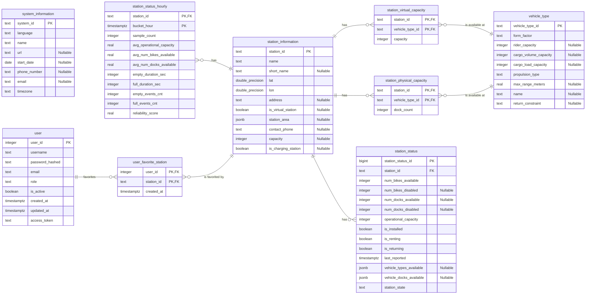

# ERD

```mermaid
erDiagram
 direction LR
    %% ═══════════════════════════════════════════════
    %% SYSTEM INFORMATION
    %% ═══════════════════════════════════════════════

    system_information {
        text system_id PK
        text language
        text name
        text url "Nullable"
        date start_date "Nullable"
        text phone_number "Nullable"
        text email "Nullable"
        text timezone
    }

    %% ═══════════════════════════════════════════════
    %% VEHICLE TYPES
    %% ═══════════════════════════════════════════════

    vehicle_type {
        text vehicle_type_id PK
        text form_factor
        integer rider_capacity "Nullable"
        integer cargo_volume_capacity "Nullable"
        integer cargo_load_capacity "Nullable"
        text propulsion_type
        real max_range_meters "Nullable"
        text name "Nullable"
        text return_constraint "Nullable"
    }

    %% ═══════════════════════════════════════════════
    %% STATION INFORMATION
    %% ═══════════════════════════════════════════════

    station_information {
        text station_id PK
        text name
        text short_name "Nullable"
        double_precision lat
        double_precision lon
        text address "Nullable"
        boolean is_virtual_station "Nullable"
        jsonb station_area "Nullable"
        text contact_phone "Nullable"
        integer capacity "Nullable"
        boolean is_charging_station "Nullable"
    }

    station_virtual_capacity {
        text station_id PK,FK
        text vehicle_type_id PK,FK
        integer capacity
    }

    station_physical_capacity {
        text station_id PK,FK
        text vehicle_type_id PK,FK
        integer dock_count
    }

    station_information ||--o{ station_virtual_capacity : "has"
    station_information ||--o{ station_physical_capacity : "has"
    station_virtual_capacity }o--|| vehicle_type : "is available at"
    station_physical_capacity }o--|| vehicle_type : "is available at"

    %% ═══════════════════════════════════════════════
    %% STATION STATUS
    %% ═══════════════════════════════════════════════

    station_status {
        bigint station_status_id PK
        text station_id FK
        integer num_bikes_available
        integer num_bikes_disabled "Nullable"
        integer num_docks_available "Nullable"
        integer num_docks_disabled "Nullable"
        integer operational_capacity
        boolean is_installed
        boolean is_renting
        boolean is_returning
        timestamptz last_reported
        jsonb vehicle_types_available "Nullable"
        jsonb vehicle_docks_available "Nullable"
        text station_state
    }

    station_information ||--o{ station_status : "has"

    %% ═══════════════════════════════════════════════
    %% STATION_STATUS_HOURLY
    %% ═══════════════════════════════════════════════

    station_status_hourly {
        text station_id PK,FK
        timestamptz bucket_hour PK
        integer sample_count
        real avg_operational_capacity
        real avg_num_bikes_available
        real avg_num_docks_available
        integer empty_duration_sec
        integer full_duration_sec
        integer empty_events_cnt
        integer full_events_cnt
        real reliability_score
    }

    station_status_hourly }o--|| station_information : "has"

    %% ═══════════════════════════════════════════════
    %% USER
    %% ═══════════════════════════════════════════════

    user {
        integer user_id PK
        text username 
        text password_hashed
        text email
        text role
        boolean is_active
        timestamptz created_at
        timestamptz updated_at
        text access_token
    }

    user_favorite_station {
        integer user_id PK,FK
        text station_id PK,FK
        timestamptz created_at
    }

    user ||--o{ user_favorite_station : "favorites"
    user_favorite_station }o--|| station_information : "is favorited by"
```
